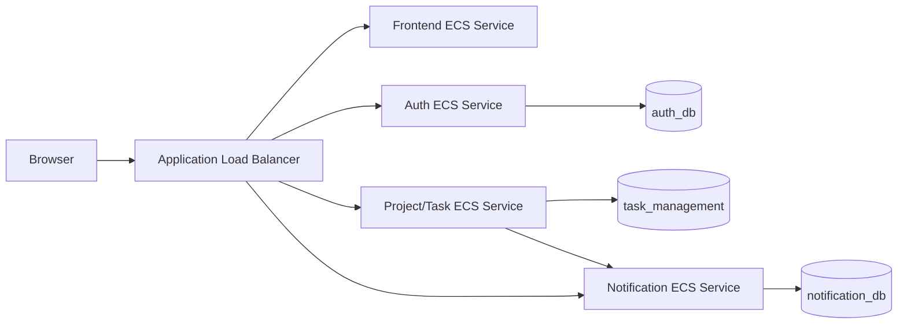

# AWS Deployment Plan For PM_Microservices

## 1. Target Architecture

Services:
- `auth` (Node.js API)
- `project-and-task-management` (Node.js API)
- `notification` (Node.js API, PostgreSQL-backed)
- `frontend` (Next.js)

Databases:
- `auth_db` (PostgreSQL)
- `task_management` (PostgreSQL)
- `notification_db` (PostgreSQL)

Recommended AWS resources:
- Amazon ECR: one repository per service image
- Amazon ECS Fargate: one task definition + one service per microservice
- Application Load Balancer (ALB): path-based routing to services
- Amazon RDS PostgreSQL:
	- Option A (cost-friendly for class): one RDS instance, 3 databases
	- Option B (stronger isolation): separate RDS instances per service
- CloudWatch Logs: log groups for all ECS tasks
- CodePipeline (and CodeBuild): CI/CD for at least one core service

## 2. Architecture Diagram (for report/slides)



Routing suggestion:
- `/` -> frontend target group
- `/api/auth/*` -> auth target group
- `/api/projects/*`, `/api/tasks/*` -> project/task target group
- `/api/notifications/*` -> notification target group

## 3. Pre-Deployment Checklist

- AWS account + IAM user/role ready
- AWS CLI configured locally
- Docker installed locally
- VPC/subnets/security groups defined
- RDS PostgreSQL reachable from ECS services
- Environment variables prepared for each service

## 4. Build And Push Images To ECR

Create 4 ECR repositories:
- `pm-auth`
- `pm-project-task`
- `pm-notification`
- `pm-frontend`

Build and push (repeat for each service):

```bash
aws ecr get-login-password --region <region> | docker login --username AWS --password-stdin <account_id>.dkr.ecr.<region>.amazonaws.com

docker build -t pm-auth ./auth
docker tag pm-auth:latest <account_id>.dkr.ecr.<region>.amazonaws.com/pm-auth:latest
docker push <account_id>.dkr.ecr.<region>.amazonaws.com/pm-auth:latest
```

## 5. Provision Databases On RDS

Use PostgreSQL and create databases:
- `auth_db`
- `task_management`
- `notification_db`

Initialize schemas/tables:
- Run `auth/sql/init.sql`
- Run `project_and_task_management/sql/init.sql`
- Run `notification/sql/init.sql`

Security group rule:
- Allow inbound PostgreSQL (`5432`) only from ECS service security group.

## 6. Deploy Services On ECS Fargate

Create ECS cluster (Fargate).

For each service, create:
- Task definition (CPU/memory/container port)
- ECS service (desired count >= 1)
- CloudWatch log configuration

Environment variables per service:

Auth:
- `PORT=3001`
- `DB_HOST=<rds-endpoint>`
- `DB_PORT=5432`
- `DB_NAME=auth_db`
- `DB_PASSWORD=<secret>`
- `JWT_SECRET=<secret>`
- `JWT_EXPIRES=1h`

Project/Task:
- `PORT=3000`
- `DB_HOST=<rds-endpoint>`
- `DB_PORT=5432`
- `DB_NAME=task_management`
- `DB_USER=postgres`
- `DB_PASSWORD=<secret>`
- `NOTIFICATION_ENABLED=true`
- `NOTIFICATION_URL=http://<internal-notification-service>:3002/api/notifications`

Notification:
- `PORT=3002`
- `DB_HOST=<rds-endpoint>`
- `DB_PORT=5432`
- `DB_NAME=notification_db`
- `DB_USER=postgres`
- `DB_PASSWORD=<secret>`

Frontend:
- `NODE_ENV=production`
- `NEXT_PUBLIC_AUTH_SERVICE_URL=https://<alb-domain>`
- `NEXT_PUBLIC_TASK_SERVICE_URL=https://<alb-domain>`
- `NEXT_PUBLIC_NOTIFICATION_SERVICE_URL=https://<alb-domain>`

Use Secrets Manager or SSM Parameter Store for passwords/secrets.

## 7. Configure ALB

Create one ALB and listener rules:
- `/api/auth/*` -> auth target group (port 3001)
- `/api/projects/*` and `/api/tasks/*` -> project/task target group (port 3000)
- `/api/notifications/*` -> notification target group (port 3002)
- Default `/` -> frontend target group (port 3003)

Add health checks:
- Auth: `GET /health`
- Project/Task: `GET /health`
- Notification: `GET /health`
- Frontend: `GET /health`

Recommended Target Group health check settings (all 4 services):
- Protocol: `HTTP`
- Health check path: use each service path above
- Matcher (Success codes): `200-399`
- Health check interval: `30` seconds
- Health check timeout: `5` seconds
- Healthy threshold count: `2`
- Unhealthy threshold count: `2`

ECS service recommendation:
- Health check grace period: `60-120` seconds (especially useful for frontend cold start)

Quick per-target-group map:
- `tg-auth` (port `3001`): path `/health`
- `tg-project-task` (port `3000`): path `/health`
- `tg-notification` (port `3002`): path `/health`
- `tg-frontend` (port `3003`): path `/health`

## 8. CloudWatch Evidence (Required)

For report appendix, capture screenshots of:
- ECS service running tasks
- ALB target groups healthy
- RDS instance/databases
- CloudWatch log groups with request logs

## 9. CI/CD (At Least One Working Pipeline)

Minimum acceptable setup:
- Source: GitHub or CodeCommit
- Build: CodeBuild (build image and push to ECR)
- Deploy: CodePipeline ECS deploy action to update one service (suggest `project-and-task-management`)

Demonstration requirement:
- Change one API response or UI text
- Commit and push
- Pipeline runs
- ECS deploys new task revision
- Show updated behavior in browser/API call

## 10. Suggested Milestone Plan

1. Week 1: finalize architecture + split responsibilities
2. Week 2: complete container images + local compose validation
3. Week 3: deploy RDS + ECS + ALB baseline
4. Week 4: add CI/CD for one service + demo update/redeploy
5. Week 5: collect screenshots + finalize report/slides

## 11. Mapping To Course Requirements

- Docker: all services containerized
- ECR: image repositories per service
- ECS/Fargate: service runtime
- ALB: ingress and routing
- Database service: Amazon RDS PostgreSQL
- CI/CD: CodePipeline + CodeBuild (at least one service)
- CloudWatch: logs and monitoring evidence

## 12. Current Repository Notes

- Notification service already uses PostgreSQL (not in-memory anymore).
- Local docker compose runs 3 separate PostgreSQL containers for development.
- For AWS, prefer one RDS PostgreSQL instance with 3 databases first (cost-effective), then split instances if needed for stronger isolation.